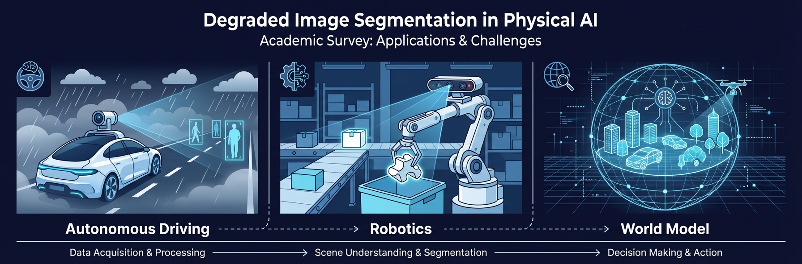

# A Survey on Degraded Image Segmentation

<div align="center">


**A comprehensive survey on robust image segmentation under various degradation conditions**

<p align="center">
  
  
  
</p>

[](https://cje.ejournal.org.cn/)
[](https://github.com/Linwei-Chen/awesome-degraded-segmentation)
[](LICENSE)

[Paper](#abstract) | [Paper List](#paper-list) | [Project Page](https://linwei-chen.github.io/awesome-degraded-segmentation/)

</div>

---

## Abstract

**Segmentation is the core of visual understanding — the foundation of Physical AI and World Model.**

Image segmentation is a fundamental task in computer vision with wide-ranging applications. While deep learning models have achieved remarkable success under ideal conditions, their performance often degrades catastrophically when faced with real-world image corruptions. These corruptions span several key categories, including adverse weather (*e.g.*, fog, rain, snow), challenging light (*e.g.*, nighttime, low-light), digital artifacts from processing (*e.g.*, compression, color jitter), various forms of blur (*e.g.*, motion, defocus), and pervasive noise (*e.g.*, sensor noise, speckle).

This survey provides a comprehensive and structured overview of the field of degraded image segmentation. We establish a detailed taxonomy of common image degradations impacting segmentation tasks. We review a wide array of datasets and benchmarks designed for evaluating robustness. Furthermore, we systematically analyze state-of-the-art methodologies, categorized by their core technical strategies: **Domain Adaptation and Generalization**, **Joint Restoration-Segmentation techniques**, and **Multi-modal Fusion**.

This survey is essential for **autonomous driving**, **robotics**, and **real-world AI systems** — the core pillars of Physical AI.

---

## Degradation Examples

<div align="center">

</div>

*Examples of various image degradation types: weather, light, digital, blur, and noise.*

---

## Physical AI Applications

<div align="center">

</div>

*Degraded image segmentation is fundamental to Physical AI — enabling reliable perception for autonomous vehicles and robots in real-world environments.*

---

## Highlights

- **135+ papers** systematically organized following the survey's methodology taxonomy
- **37 papers with open-source code** are marked with code links
- Comprehensive coverage of **5 degradation categories**: Weather, Light, Digital, Blur, Noise
- **3 main methodological strategies**: Domain Adaptation/Generalization, Joint Restoration-Segmentation, Multi-modal Fusion
- Essential for **Physical AI** — the foundation of autonomous driving, robotics, and real-world AI systems

---

## Paper List

> Papers with available code are marked with a code link in the "Code" column.


## 1. Domain Adaptation & Generalization (DA/DG)

### 1.1 Adversarial Learning Approaches

| Title | Authors | Year | Venue | Code | BibTeX |
|:------|:--------|:----:|:-----:|:----:|:------:|
| ICDA: Illumination-Coupled Domain Adaptation Framework for Unsupervised Nighttim... | Dong et al. | 2023 | IJCAI | [Code](https://github.com/chenghaoDong666/ICDA) | [BibTeX](assets/bibtex/dong2023icda.txt) |
| A one-stage domain adaptation network with image alignment for unsupervised nigh... | Wu et al. | 2021 | PAMI | [Code](https://github.com/W-zx-Y/DANNet) | [BibTeX](assets/bibtex/wu2021one.txt) |
| Dual-branch teacher-student with noise-tolerant learning for domain adaptive nig... | Chen et al. | 2024 | Image and Vision Com... | - | [BibTeX](assets/bibtex/chen2024dual.txt) |
| Weakly supervised semantic segmentation for point cloud based on view-based adve... | Miao et al. | 2023 | Computers \& Graphic... | - | [BibTeX](assets/bibtex/miao2023weakly.txt) |
| All-weather road drivable area segmentation method based on CycleGAN | Jiqing et al. | 2023 | The Visual Computer | - | [BibTeX](assets/bibtex/jiqing2023all.txt) |
| FISS GAN: A generative adversarial network for foggy image semantic segmentation | Liu et al. | 2021 | IEEE/CAA Journal of ... | - | [BibTeX](assets/bibtex/liu2021fiss.txt) |
| Semantic segmentation with unsupervised domain adaptation under varying weather ... | Erkent et al. | 2020 | IEEE Robotics and Au... | - | [BibTeX](assets/bibtex/erkent2020semantic.txt) |
| Nighttime road scene parsing by unsupervised domain adaptation | Song et al. | 2020 | IEEE transactions on... | - | [BibTeX](assets/bibtex/song2020nighttime.txt) |
| Heatnet: Bridging the day-night domain gap in semantic segmentation with thermal... | Vertens et al. | 2020 | 2020 IEEE/RSJ Intern... | - | [BibTeX](assets/bibtex/vertens2020heatnet.txt) |
| Advent: Adversarial entropy minimization for domain adaptation in semantic segme... | Vu et al. | 2019 | CVPR | - | [BibTeX](assets/bibtex/vu2019advent.txt) |

### 1.2 Feature Alignment

| Title | Authors | Year | Venue | Code | BibTeX |
|:------|:--------|:----:|:-----:|:----:|:------:|
| Condition-invariant semantic segmentation | Sakaridis et al. | 2025 | PAMI | [Code](https://github.com/SysCV/CISS) | [BibTeX](assets/bibtex/sakaridis2025condition.txt) |
| Contrastive model adaptation for cross-condition robustness in semantic segmenta... | Br{\""u et al. | 2023 | ICCV | [Code](https://github.com/brdav/cma) | [BibTeX](assets/bibtex/bruggemann2023contrastive.txt) |
| Degraded Image Semantic Segmentation Using Intra-image and Inter-image Contrasti... | Dong et al. | 2023 | China Automation Con... | [Code](https://github.com/cocolord/degraded_image_seg) | [BibTeX](assets/bibtex/dong2023degraded.txt) |
| Cross-domain correlation distillation for unsupervised domain adaptation in nigh... | Gao et al. | 2022 | CVPR | [Code](https://github.com/ghuan99/CCDistill) | [BibTeX](assets/bibtex/gao2022cross.txt) |
| Computational Imaging for Machine Perception: Transferring Semantic Segmentation... | Jiang et al. | 2024 | IEEE Transactions on... | - | [BibTeX](assets/bibtex/jiang2024computational.txt) |
| Refign: Align and refine for adaptation of semantic segmentation to adverse cond... | Br{\""u et al. | 2023 | WACV | - | [BibTeX](assets/bibtex/bruggemann2023refign.txt) |
| Fifo: Learning fog-invariant features for foggy scene segmentation. | Lee et al. | 2022 | CVPR | - | [BibTeX](assets/bibtex/lee2022fifo.txt) |
| Cluster alignment with target knowledge mining for unsupervised domain adaptatio... | Wang et al. | 2022 | IEEE Transactions on... | - | [BibTeX](assets/bibtex/wang2022cluster.txt) |
| Learning intra-domain style-invariant representation for unsupervised domain ada... | Li et al. | 2022 | Pattern Recognition | - | [BibTeX](assets/bibtex/li2022learning.txt) |
| Semantic nighttime image segmentation via illumination and position aware domain... | Peng et al. | 2021 | 2021 IEEE Internatio... | - | [BibTeX](assets/bibtex/peng2021semantic.txt) |
| Learning texture invariant representation for domain adaptation of semantic segm... | Kim et al. | 2020 | CVPR | - | [BibTeX](assets/bibtex/kim2020learning.txt) |
| Degraded image semantic segmentation with dense-gram networks | Guo et al. | 2019 | IEEE Transactions on... | - | [BibTeX](assets/bibtex/guo2019degraded.txt) |
| Ssf-dan: Separated semantic feature based domain adaptation network for semantic... | Du et al. | 2019 | ICCV | - | [BibTeX](assets/bibtex/du2019ssf.txt) |

### 1.3 Feature Decomposition

| Title | Authors | Year | Venue | Code | BibTeX |
|:------|:--------|:----:|:-----:|:----:|:------:|
| Learning generalized segmentation for foggy-scenes by bi-directional wavelet gui... | Bi et al. | 2024 | the AAAI Conference ... | [Code](https://github.com/BiQiWHU/BWG) | [BibTeX](assets/bibtex/bi2024learning.txt) |
| When semantic segmentation meets frequency aliasing | Chen et al. | 2024 | ICLR | [Code](https://github.com/Linwei-Chen/Seg-Aliasing) | [BibTeX](assets/bibtex/chen2024semantic.txt) |
| All about structure: Adapting structural information across domains for boosting... | Chang et al. | 2019 | CVPR | [Code](https://github.com/a514514772/DISE-Domain-Invariant-Structure-Extraction) | [BibTeX](assets/bibtex/chang2019all.txt) |
| Generalized Foggy-Scene Semantic Segmentation by Frequency Decoupling | Bi et al. | 2024 | CVPR | - | [BibTeX](assets/bibtex/bi2024generalized.txt) |
| DDFL: Dual-Domain Feature Learning for nighttime semantic segmentation | Lin et al. | 2024 | Displays | - | [BibTeX](assets/bibtex/lin2024ddfl.txt) |
| Disentangle then Parse: Night-time Semantic Segmentation with Illumination Disen... | Wei et al. | 2023 | ICCV | - | [BibTeX](assets/bibtex/wei2023disentangle.txt) |
| Interactive learning of intrinsic and extrinsic properties for all-day semantic ... | Bi et al. | 2023 | IEEE Transactions on... | - | [BibTeX](assets/bibtex/bi2023interactive.txt) |
| Both style and fog matter: Cumulative domain adaptation for semantic foggy scene... | Ma et al. | 2022 | CVPR | - | [BibTeX](assets/bibtex/ma2022both.txt) |

### 1.4 Self-Training & Pseudo-Labeling

| Title | Authors | Year | Venue | Code | BibTeX |
|:------|:--------|:----:|:-----:|:----:|:------:|
| Stable Neighbor Denoising for Source-free Domain Adaptive Segmentation | Zhao et al. | 2024 | CVPR | [Code](https://github.com/DZhaoXd/SND) | [BibTeX](assets/bibtex/zhao2024stable.txt) |
| Self pseudo entropy knowledge distillation for semi-supervised semantic segmenta... | Lu et al. | 2024 | IEEE Transactions on... | [Code](https://github.com/xiaoqiang-lu/SPEED) | [BibTeX](assets/bibtex/lu2024self.txt) |
| VBLC: Visibility boosting and logit-constraint learning for domain adaptive sema... | Li et al. | 2023 | the AAAI Conference ... | [Code](https://github.com/BIT-DA/VBLC) | [BibTeX](assets/bibtex/li2023vblc.txt) |
| LoopDA: Constructing self-loops to adapt nighttime semantic segmentation | Shen et al. | 2023 | WACV | [Code](https://github.com/fy-vision/LoopDA) | [BibTeX](assets/bibtex/shen2023loopda.txt) |
| Dtbs: Dual-teacher bi-directional self-training for domain adaptation in nightti... | Huang et al. | 2023 | European Conference ... | [Code](https://github.com/hf618/DTBS) | [BibTeX](assets/bibtex/huang2023dtbs.txt) |
| Online domain adaptation for semantic segmentation in ever-changing conditions | Panagiotakopoulos et al. | 2022 | European Conference ... | [Code](https://github.com/theo2021/OnDA) | [BibTeX](assets/bibtex/panagiotakopoulos2022online.txt) |
| Bidirectional learning for domain adaptation of semantic segmentation | Li et al. | 2019 | CVPR | [Code](https://github.com/liyunsheng13/BDL) | [BibTeX](assets/bibtex/li2019bidirectional.txt) |
| Source-Free Online Domain Adaptive Semantic Segmentation of Satellite Images Und... | Niloy et al. | 2024 | ICASSP 2024-2024 IEE... | - | [BibTeX](assets/bibtex/niloy2024source.txt) |
| SDAT-Former++: A Foggy Scene Semantic Segmentation Method with Stronger Domain A... | Wang et al. | 2023 | Remote Sensing | - | [BibTeX](assets/bibtex/wang2023sdat.txt) |
| A Two-Stage Self-Training Framework for Nighttime Semantic Segmentation | Yang et al. | 2023 | 2023 38th Youth Acad... | - | [BibTeX](assets/bibtex/yang2023two.txt) |
| SGDA: A Saliency-Guided Domain Adaptation Network for Nighttime Semantic Segment... | Duan et al. | 2023 | 2023 IEEE 6th Intern... | - | [BibTeX](assets/bibtex/duan2023sgda.txt) |
| Dual-level Consistency Learning for Unsupervised Domain Adaptive Night-time Sema... | Ding et al. | 2023 | 2023 IEEE Internatio... | - | [BibTeX](assets/bibtex/ding2023dual.txt) |
| MADA: Multi-Level Alignment in Domain Adaptation Network for Nighttime Semantic ... | Xu et al. | 2023 | 2023 8th Internation... | - | [BibTeX](assets/bibtex/xu2023mada.txt) |
| A hybrid domain learning framework for unsupervised semantic segmentation | Zhang et al. | 2023 | Neurocomputing | - | [BibTeX](assets/bibtex/zhang2023hybrid.txt) |
| FogAdapt: Self-supervised domain adaptation for semantic segmentation of foggy i... | Iqbal et al. | 2022 | Neurocomputing | - | [BibTeX](assets/bibtex/iqbal2022fogadapt.txt) |
| Unsupervised foggy scene understanding via self spatial-temporal label diffusion | Liao et al. | 2022 | IEEE Transactions on... | - | [BibTeX](assets/bibtex/liao2022unsupervised.txt) |
| Augmentation consistency-guided self-training for source-free domain adaptive se... | Prabhu et al. | 2022 | NeurIPS 2022 Worksho... | - | [BibTeX](assets/bibtex/prabhu2022augmentation.txt) |
| SS-SFDA: Self-supervised source-free domain adaptation for road segmentation in ... | Kothandaraman et al. | 2021 | ICCV | - | [BibTeX](assets/bibtex/kothandaraman2021ss.txt) |
| CDAda: A curriculum domain adaptation for nighttime semantic segmentation | Xu et al. | 2021 | ICCV | - | [BibTeX](assets/bibtex/xu2021cdada.txt) |
| RanPaste: Paste consistency and pseudo label for semisupervised remote sensing i... | Wang et al. | 2021 | IEEE Transactions on... | - | [BibTeX](assets/bibtex/wang2021ranpaste.txt) |

### 1.5 Knowledge Distillation

| Title | Authors | Year | Venue | Code | BibTeX |
|:------|:--------|:----:|:-----:|:----:|:------:|
| Lightweight deep learning methods for panoramic dental X-ray image segmentation | Lin et al. | 2023 | Neural Computing and... | [Code](https://github.com/IvisionLab/dental-image) | [BibTeX](assets/bibtex/lin2023lightweight.txt) |
| Weather-degraded image semantic segmentation with multi-task knowledge distillat... | Li et al. | 2022 | Image and Vision Com... | - | [BibTeX](assets/bibtex/li2022weather.txt) |
| Self-feature distillation with uncertainty modeling for degraded image recogniti... | Yang et al. | 2022 | European Conference ... | - | [BibTeX](assets/bibtex/yang2022self.txt) |
| Robust semantic segmentation with multi-teacher knowledge distillation | Amirkhani et al. | 2021 | IEEE Access | - | [BibTeX](assets/bibtex/amirkhani2021robust.txt) |
| Efficient uncertainty estimation in semantic segmentation via distillation | Holder et al. | 2021 | ICCV | - | [BibTeX](assets/bibtex/holder2021efficient.txt) |

### 1.6 Test-Time Adaptation & Continual Learning

| Title | Authors | Year | Venue | Code | BibTeX |
|:------|:--------|:----:|:-----:|:----:|:------:|
| Privacy-Preserving Synthetic Continual Semantic Segmentation for Robotic Surgery | Xu et al. | 2024 | IEEE Transactions on... | [Code](https://github.com/XuMengyaAmy/Synthetic_CAT_SD) | [BibTeX](assets/bibtex/xu2024privacy.txt) |
| Enhanced Model Robustness to Input Corruptions by Per-corruption Adaptation of N... | Camuffo et al. | 2024 | 2024 IEEE/RSJ Intern... | - | [BibTeX](assets/bibtex/camuffo2024enhanced.txt) |
| Test-time adaptation for nighttime color-thermal semantic segmentation | Liu et al. | 2023 | IEEE Transactions on... | - | [BibTeX](assets/bibtex/liu2023test.txt) |
| Test-time training for matching-based video object segmentation | Bertrand et al. | 2023 | Advances in Neural I... | - | [BibTeX](assets/bibtex/bertrand2023test.txt) |
| Top-K Confidence Map Aggregation for Robust Semantic Segmentation Against Unexpe... | Moriyasu et al. | 2023 | 2023 IEEE Internatio... | - | [BibTeX](assets/bibtex/moriyasu2023top.txt) |
| Principles of forgetting in domain-incremental semantic segmentation in adverse ... | Kalb et al. | 2023 | CVPR | - | [BibTeX](assets/bibtex/kalb2023principles.txt) |
| Rethinking exemplars for continual semantic segmentation in endoscopy scenes: En... | Wang et al. | 2023 | Computers in Biology... | - | [BibTeX](assets/bibtex/wang2023rethinking.txt) |
| To adapt or not to adapt? real-time adaptation for semantic segmentation | Colomer et al. | 2023 | ICCV | - | [BibTeX](assets/bibtex/colomer2023adapt.txt) |
| Continual test-time domain adaptation | Wang et al. | 2022 | CVPR | - | [BibTeX](assets/bibtex/wang2022continual.txt) |
| Continual unsupervised domain adaptation for semantic segmentation using a class... | Marsden et al. | 2022 | 2022 International J... | - | [BibTeX](assets/bibtex/marsden2022continual.txt) |

### 1.7 Other DA/DG Strategies

| Title | Authors | Year | Venue | Code | BibTeX |
|:------|:--------|:----:|:-----:|:----:|:------:|
| A Re-Parameterized Vision Transformer (ReVT) for Domain-Generalized Semantic Seg... | Term{\""o et al. | 2023 | ICCV | [Code](https://github.com/ifnspaml/ReVT) | [BibTeX](assets/bibtex/termohlen2023re.txt) |
| Map-guided curriculum domain adaptation and uncertainty-aware evaluation for sem... | Sakaridis et al. | 2020 | PAMI | [Code](https://github.com/sakaridis/MGCDA) | [BibTeX](assets/bibtex/sakaridis2020map.txt) |
| Complementary Masked-Guided Meta-Learning for Domain Adaptive Nighttime Segmenta... | Chen et al. | 2024 | IEEE Signal Processi... | - | [BibTeX](assets/bibtex/chen2024complementary.txt) |
| CAT: Exploiting Inter-Class Dynamics for Domain Adaptive Object Detection | Kennerley et al. | 2024 | CVPR | - | [BibTeX](assets/bibtex/kennerley2024cat.txt) |
| Learning to learn single domain generalization | Qiao et al. | 2020 | CVPR | - | [BibTeX](assets/bibtex/qiao2020learning.txt) |
| Curriculum model adaptation with synthetic and real data for semantic foggy scen... | Dai et al. | 2020 | International Journa... | - | [BibTeX](assets/bibtex/dai2020curriculum.txt) |
| Guided curriculum model adaptation and uncertainty-aware evaluation for semantic... | Sakaridis et al. | 2019 | ICCV | - | [BibTeX](assets/bibtex/sakaridis2019guided.txt) |
| Model adaptation with synthetic and real data for semantic dense foggy scene und... | Sakaridis et al. | 2018 | ECCV | - | [BibTeX](assets/bibtex/sakaridis2018model.txt) |


## 2. Joint Restoration & Segmentation

### 2.1 Dehazing/Defogging + Segmentation

| Title | Authors | Year | Venue | Code | BibTeX |
|:------|:--------|:----:|:-----:|:----:|:------:|
| Improving semantic segmentation under hazy weather for autonomous vehicles using... | Saravanarajan et al. | 2023 | IEEE Access | - | [BibTeX](assets/bibtex/saravanarajan2023improving.txt) |
| Budget-Aware Road Semantic Segmentation in Unseen Foggy Scenes | To et al. | 2023 | International Confer... | - | [BibTeX](assets/bibtex/to2023budget.txt) |
| Rethinking image restoration for object detection | Sun et al. | 2022 | Advances in Neural I... | - | [BibTeX](assets/bibtex/sun2022rethinking.txt) |
| Cooperative semantic segmentation and image restoration in adverse environmental... | Xia et al. | 2019 | arXiv preprint arXiv... | - | [BibTeX](assets/bibtex/xia2019cooperative.txt) |
| A convolutional network for joint deraining and dehazing from a single image for... | Sun et al. | 2019 | 2019 IEEE/RSJ Intern... | - | [BibTeX](assets/bibtex/sun2019convolutional.txt) |

### 2.2 Deraining + Segmentation

| Title | Authors | Year | Venue | Code | BibTeX |
|:------|:--------|:----:|:-----:|:----:|:------:|
| DRNet: Learning a dynamic recursion network for chaotic rain streak removal | Jiang et al. | 2025 | Pattern Recognition | [Code](https://github.com/Jzy2017/DRNet) | [BibTeX](assets/bibtex/jiang2025drnet.txt) |
| Rainy day image semantic segmentation based on two-stage progressive network | Zhang et al. | 2024 | The Visual Computer | [Code](https://github.com/zhang152267/TSPN) | [BibTeX](assets/bibtex/zhang2024rainy.txt) |
| RCDNet: An interpretable rain convolutional dictionary network for single image ... | Wang et al. | 2023 | IEEE Transactions on... | [Code](https://github.com/hongwang01/DRCDNet) | [BibTeX](assets/bibtex/wang2023rcdnet.txt) |
| SAPNet: Segmentation-aware progressive network for perceptual contrastive derain... | Zheng et al. | 2022 | WACV | [Code](https://github.com/ShenZheng2000/SAPNe-for-image-deraining) | [BibTeX](assets/bibtex/zheng2022sapnet.txt) |
| Beyond monocular deraining: Parallel stereo deraining network via semantic prior | Zhang et al. | 2022 | International Journa... | [Code](https://github.com/HDCVLab/Stereo-Image-Deraining) | [BibTeX](assets/bibtex/zhang2022beyond.txt) |
| Towards robust rain removal against adversarial attacks: A comprehensive benchma... | Yu et al. | 2022 | CVPR | [Code](https://github.com/yuyisd/Robust_Rain_Removal) | [BibTeX](assets/bibtex/yu2022towards.txt) |
| A De-raining semantic segmentation network for real-time foreground segmentation | Wang et al. | 2021 | Journal of Real-Time... | [Code](https://github.com/dandingbudanding/DRSNet) | [BibTeX](assets/bibtex/wang2021raining.txt) |
| Style Optimization Networks for real-time semantic segmentation of rainy and fog... | Huang et al. | 2025 | Signal Processing: I... | - | [BibTeX](assets/bibtex/huang2025style.txt) |
| Learning A Rain-Invariant Network For Instance Segmentation In The Rain | Chen et al. | 2024 | 2024 IEEE Internatio... | - | [BibTeX](assets/bibtex/chen2024learning.txt) |
| Real rainy scene analysis: A dual-module benchmark for image deraining and segme... | Zhao et al. | 2023 | 2023 IEEE Internatio... | - | [BibTeX](assets/bibtex/zhao2023real.txt) |
| Improved sea-ice identification using semantic segmentation with raindrop remova... | Alsharay et al. | 2022 | IEEE Access | - | [BibTeX](assets/bibtex/alsharay2022improved.txt) |
| I can see clearly now: Image restoration via de-raining | Porav et al. | 2019 | ICRA | - | [BibTeX](assets/bibtex/porav2019can.txt) |

### 2.3 Denoising + Segmentation

| Title | Authors | Year | Venue | Code | BibTeX |
|:------|:--------|:----:|:-----:|:----:|:------:|
| Instance Segmentation in the Dark | Chen et al. | 2023 | IJCV | [Code](https://github.com/Linwei-Chen/LIS) | [BibTeX](assets/bibtex/2023lis.txt) |
| AATCT-IDS: A benchmark Abdominal Adipose Tissue CT Image Dataset for image denoi... | Ma et al. | 2024 | Computers in Biology... | - | [BibTeX](assets/bibtex/ma2024aatct.txt) |
| Multi task deep learning phase unwrapping method based on semantic segmentation | Wang et al. | 2024 | Journal of Optics | - | [BibTeX](assets/bibtex/wang2024multi.txt) |
| Plug-and-Play Joint Image Deblurring and Detection | Marrs et al. | 2023 | 2023 IEEE 25th Inter... | - | [BibTeX](assets/bibtex/marrs2023plug.txt) |
| Segmentation-guided semantic-aware self-supervised denoising for SAR image | Yuan et al. | 2023 | IEEE Transactions on... | - | [BibTeX](assets/bibtex/yuan2023segmentation.txt) |
| Denoising pretraining for semantic segmentation | Brempong et al. | 2022 | CVPR_Workshops | - | [BibTeX](assets/bibtex/brempong2022denoising.txt) |
| Speckle reduction via deep content-aware image prior for precise breast tumor se... | Lee et al. | 2022 | IEEE Transactions on... | - | [BibTeX](assets/bibtex/lee2022speckle.txt) |
| Efnet: Enhancement-fusion network for semantic segmentation | Wang et al. | 2021 | Pattern Recognition | - | [BibTeX](assets/bibtex/wang2021efnet.txt) |
| Effective image restoration for semantic segmentation | Niu et al. | 2020 | Neurocomputing | - | [BibTeX](assets/bibtex/niu2020effective.txt) |
| Dapas: Denoising autoencoder to prevent adversarial attack in semantic segmentat... | Cho et al. | 2020 | 2020 International J... | - | [BibTeX](assets/bibtex/cho2020dapas.txt) |
| Improved denoising autoencoder for maritime image denoising and semantic segment... | Qiu et al. | 2020 | China Communications | - | [BibTeX](assets/bibtex/qiu2020improved.txt) |
| DN-GAN: Denoising generative adversarial networks for speckle noise reduction in... | Chen et al. | 2020 | Biomedical Signal Pr... | - | [BibTeX](assets/bibtex/chen2020dn.txt) |

### 2.4 Deblurring + Segmentation

| Title | Authors | Year | Venue | Code | BibTeX |
|:------|:--------|:----:|:-----:|:----:|:------:|
| Turb-Seg-Res: A Segment-then-Restore Pipeline for Dynamic Videos with Atmospheri... | Saha et al. | 2024 | CVPR | - | [BibTeX](assets/bibtex/saha2024turb.txt) |
| Automatic extraction of blur regions on a single image based on semantic segment... | Shen et al. | 2020 | IEEE Access | - | [BibTeX](assets/bibtex/shen2020automatic.txt) |
| Joint stereo video deblurring, scene flow estimation and moving object segmentat... | Pan et al. | 2019 | IEEE Transactions on... | - | [BibTeX](assets/bibtex/pan2019joint.txt) |
| From motion blur to motion flow: A deep learning solution for removing heterogen... | Gong et al. | 2017 | CVPR | - | [BibTeX](assets/bibtex/gong2017motion.txt) |

### 2.5 Snow/Dust Removal + Segmentation

| Title | Authors | Year | Venue | Code | BibTeX |
|:------|:--------|:----:|:-----:|:----:|:------:|
| Deep dense multi-scale network for snow removal using semantic and depth priors | Zhang et al. | 2021 | IEEE Transactions on... | [Code](https://github.com/HDCVLab/Deep-Dense-Multi-scale-Network) | [BibTeX](assets/bibtex/zhang2021deep.txt) |
| Semantic Segmentation and Inpainting of Dust with the S-Dust Dataset | Buckel et al. | 2023 | International Federa... | - | [BibTeX](assets/bibtex/buckel2023semantic.txt) |

### 2.6 Low-Light Enhancement + Segmentation

| Title | Authors | Year | Venue | Code | BibTeX |
|:------|:--------|:----:|:-----:|:----:|:------:|
| Nighttime image semantic segmentation with retinex theory | Sun et al. | 2024 | Image and Vision Com... | [Code](https://github.com/sunzc-sunny/RNightSeg) | [BibTeX](assets/bibtex/sun2024nighttime.txt) |
| Improving nighttime driving-scene segmentation via dual image-adaptive learnable... | Liu et al. | 2023 | IEEE Transactions on... | [Code](https://github.com/wenyyu/IA-Seg) | [BibTeX](assets/bibtex/liu2023improving.txt) |
| Toward fast, flexible, and robust low-light image enhancement | Ma et al. | 2022 | CVPR | [Code](https://github.com/vis-opt-group/SCI) | [BibTeX](assets/bibtex/ma2022toward.txt) |
| Lane detection based on real-time semantic segmentation for end-to-end autonomou... | Liu et al. | 2024 | Digital Signal Proce... | - | [BibTeX](assets/bibtex/liu2024lane.txt) |
| Towards learning low-light indoor semantic segmentation with illumination-invari... | Zhang et al. | 2021 | The International Ar... | - | [BibTeX](assets/bibtex/zhang2021towards.txt) |

### 2.7 JPEG Decoding + Segmentation

| Title | Authors | Year | Venue | Code | BibTeX |
|:------|:--------|:----:|:-----:|:----:|:------:|
| DSSLIC: Deep semantic segmentation-based layered image compression | Akbari et al. | 2019 | IEEE International C... | [Code](https://github.com/makbari7/DSSLIC) | [BibTeX](assets/bibtex/akbari2019dsslic.txt) |
| DCT-CompSegNet: fast layout segmentation in DCT compressed JPEG document images ... | Rajesh et al. | 2024 | Multimedia Tools and... | - | [BibTeX](assets/bibtex/rajesh2024dct.txt) |
| Semantic segmentation in learned compressed domain | Liu et al. | 2022 | Picture Coding Sympo... | - | [BibTeX](assets/bibtex/liu2022semantic.txt) |
| Reverse error modeling for improved semantic segmentation | Kuhn et al. | 2022 | IEEE International C... | - | [BibTeX](assets/bibtex/kuhn2022reverse.txt) |
| Deep learning based image segmentation directly in the jpeg compressed domain | Singh et al. | 2021 | 2021 IEEE 8th Uttar ... | - | [BibTeX](assets/bibtex/singh2021deep.txt) |
| Semantic segmentation of JPEG blocks using a deep CNN for non-aligned JPEG forge... | Alipour et al. | 2020 | Multimedia Tools and... | - | [BibTeX](assets/bibtex/alipour2020semantic.txt) |


## 3. Multi-Modal Fusion

### 3.1 RGB + Thermal Fusion

| Title | Authors | Year | Venue | Code | BibTeX |
|:------|:--------|:----:|:-----:|:----:|:------:|
| MCNet: Multi-level correction network for thermal image semantic segmentation of... | Xiong et al. | 2021 | Infrared Physics \& ... | [Code](https://github.com/haitaobiyao/MCNet) | [BibTeX](assets/bibtex/xiong2021mcnet.txt) |
| Illumination Robust Semantic Segmentation Based on Cross-dimensional Multispectr... | Ni et al. | 2024 | IEEE Access | - | [BibTeX](assets/bibtex/ni2024illumination.txt) |
| CCAFFMNet: Dual-spectral semantic segmentation network with channel-coordinate a... | Yi et al. | 2022 | Neurocomputing | - | [BibTeX](assets/bibtex/yi2022ccaffmnet.txt) |
| FuseSeg: Semantic segmentation of urban scenes based on RGB and thermal data fus... | Sun et al. | 2020 | IEEE Transactions on... | - | [BibTeX](assets/bibtex/sun2020fuseseg.txt) |
| Robust semantic segmentation in adverse weather conditions by means of sensor da... | Pfeuffer et al. | 2019 | International Confer... | - | [BibTeX](assets/bibtex/pfeuffer2019robust.txt) |
| RTFNet: RGB-thermal fusion network for semantic segmentation of urban scenes | Sun et al. | 2019 | IEEE Robotics and Au... | - | [BibTeX](assets/bibtex/sun2019rtfnet.txt) |

### 3.2 RGB + LiDAR/Depth Fusion

| Title | Authors | Year | Venue | Code | BibTeX |
|:------|:--------|:----:|:-----:|:----:|:------:|
| Low-Light Enhancement and Global-Local Feature Interaction for RGB-T Semantic Se... | Guo et al. | 2025 | IEEE Transactions on... | [Code](https://github.com/Yuyu-1015/LLE-Seg) | [BibTeX](assets/bibtex/guo2025low.txt) |
| Adaptive Entropy Multi-modal Fusion for Nighttime Lane Segmentation | Zhang et al. | 2024 | IEEE Transactions on... | - | [BibTeX](assets/bibtex/zhang2024adaptive.txt) |
| Delivering arbitrary-modal semantic segmentation | Zhang et al. | 2023 | CVPR | - | [BibTeX](assets/bibtex/zhang2023delivering.txt) |
| Multi-robot collaborative perception with graph neural networks | Zhou et al. | 2022 | IEEE Robotics and Au... | - | [BibTeX](assets/bibtex/zhou2022multi.txt) |
| Multi-modal sensor fusion-based semantic segmentation for snow driving scenarios | Vachmanus et al. | 2021 | IEEE sensors journal | - | [BibTeX](assets/bibtex/vachmanus2021multi.txt) |
| UNO: Uncertainty-aware noisy-or multimodal fusion for unanticipated input degrad... | Tian et al. | 2020 | ICRA | - | [BibTeX](assets/bibtex/tian2020uno.txt) |

### 3.3 RGB + Event Camera Fusion

| Title | Authors | Year | Venue | Code | BibTeX |
|:------|:--------|:----:|:-----:|:----:|:------:|
| Event-assisted low-light video object segmentation | Li et al. | 2024 | CVPR | [Code](https://github.com/HebeiFast/EventLowLightVOS) | [BibTeX](assets/bibtex/li2024event.txt) |
| Cmda: Cross-modality domain adaptation for nighttime semantic segmentation | Xia et al. | 2023 | ICCV | [Code](https://github.com/XiaRho/CMDA) | [BibTeX](assets/bibtex/xia2023cmda.txt) |
| Semantic Segmentation Research of Motion Blurred Images by Event Camera | Liu et al. | 2023 | International Confer... | - | [BibTeX](assets/bibtex/liu2023semantic.txt) |

---

## Citation

If you find this survey helpful, please cite:

```bibtex
@article{chen2025degraded,
  title={A Survey on Degraded Image Segmentation},
  author={Chen, Linwei and Fu, Ying and Shangguan, Jingyu and Xu, Jinglin and Peng, Yuxin},
  journal={Chinese Journal of Electronics},
  year={2025}
}
```

## Contributing

We welcome contributions! Please feel free to submit a Pull Request to add new papers or fix any issues.

## Contact

- **Linwei Chen** - chenlinwei.ai@gmail.com
- **Ying Fu** (Corresponding Author) - fuying@bit.edu.cn

---

<div align="center">
Made with care for the Computer Vision Community
</div>
